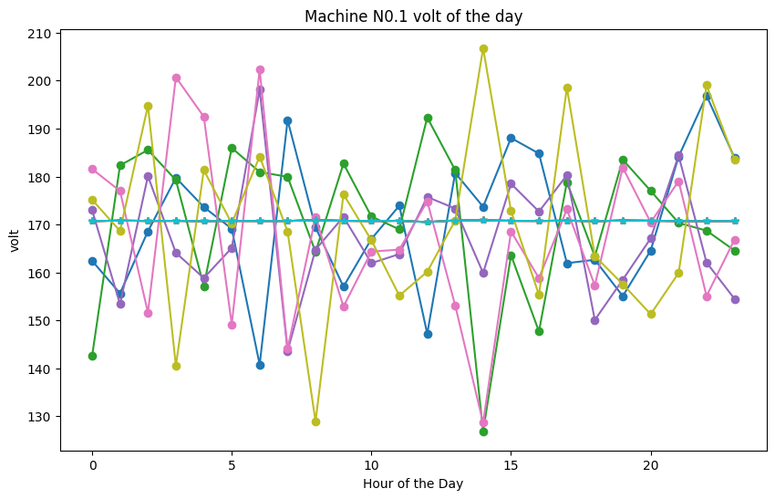
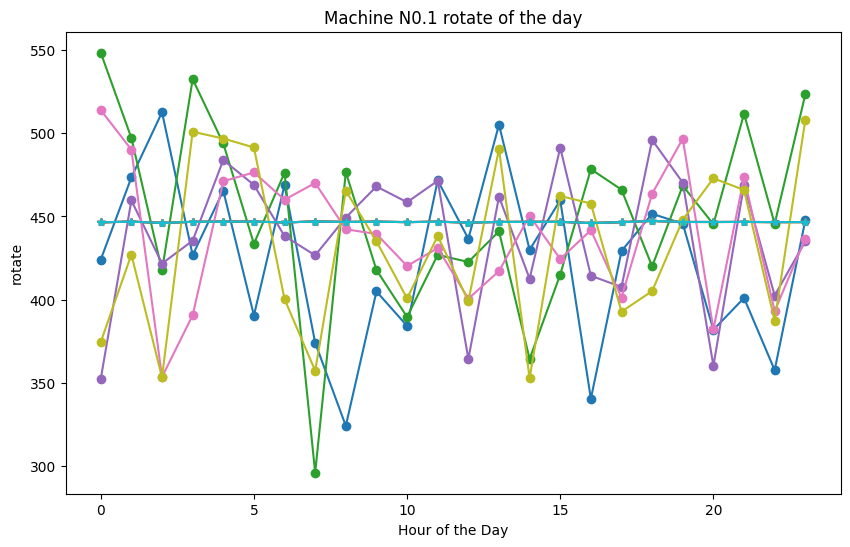
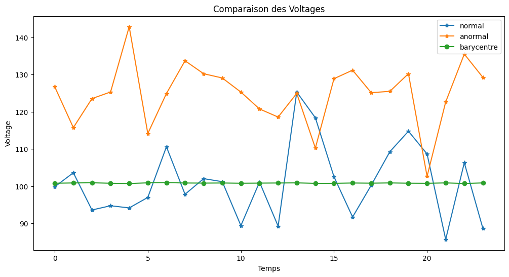

# Détection d'anomalies pour la maintenance prédictive par transport optimal

**Auteurs** : Adil AHIDAR, Issiaka KANAZOE, Landry Yves Joel SEBEOGO, Namou Karl Alban KADEWA, Palingwend Sosthène ZONGO, Thomas Christian BADOLO
**Affiliation** : École Centrale Casablanca

Détecter qu'une machine dérive, avant qu'elle ne tombe en panne, en combinant prévision de séries temporelles et **transport optimal**.

## L'idée

La maintenance prédictive se heurte à une difficulté : on dispose de beaucoup de données de fonctionnement normal et de très peu de pannes. Entraîner un classifieur supervisé est donc mal posé — il n'y a presque rien à lui montrer du côté des défaillances.

L'approche retenue contourne le problème. Plutôt que d'apprendre à reconnaître une panne, on apprend à quoi ressemble le **fonctionnement normal**, et on mesure l'écart.

Le transport optimal fournit précisément cette mesure d'écart entre deux distributions : il quantifie le coût minimal pour transformer l'une en l'autre. Appliqué à une fenêtre d'observations récentes contre une fenêtre de référence, il donne une distance qui augmente quand le comportement de la machine change — sans qu'on ait eu besoin d'un seul exemple de panne.

L'avantage sur des critères plus simples est qu'il tient compte de la **géométrie** des distributions : deux histogrammes qui ne se recouvrent pas du tout obtiennent une divergence de Kullback-Leibler infinie, alors que le transport optimal les distingue selon leur éloignement réel.

## Résultats







## Contenu du dépôt

| Fichier | Rôle |
| --- | --- |
| `Predictive_Maintenance.ipynb` | Analyse, prévision et détection |
| `Optimal transport and machine learning for predictive maintenance.pdf` | L'article complet |
| `assets/` | Figures extraites du carnet |

## Exécution

```bash
pip install numpy pandas scikit-learn pot matplotlib jupyter
jupyter notebook Predictive_Maintenance.ipynb
```

`pot` est la bibliothèque Python Optimal Transport.

## Portée

Le seuil de déclenchement reste le point délicat : trop bas, l'alerte se déclenche sur du bruit et perd sa crédibilité auprès des équipes de maintenance ; trop haut, elle arrive trop tard pour servir à quelque chose. Le fixer demande de connaître le coût d'une intervention inutile comparé à celui d'un arrêt subi.
